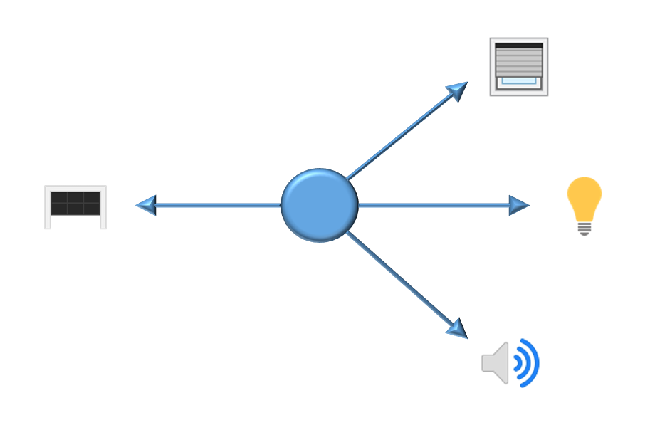

This web page gives an overview of the project group VICToRy, starting in winter term 2018/19 at Paderborn University.
The slides of the presentation on 16.07.2018 can be downloaded [here](./assets/victory.pdf).
Note that a formless letter of motivation must be sent by **24.08.2018** to [Nils Weidmann](<nilsweid@mail.upb.de>) to participate in this project group!   

## Motivation and Introduction

The development and maintenance of large software systems remains a complex, error-prone task. Model-Driven Engineering (MDE) addresses complexity by establishing suitable abstractions (models) and treating them as primary artefacts in the development process; models are used for validation, code generation, and testing purposes. Amongst other advantages, this MDE approach enables domain experts such as engineers or business analysts to specify and validate their models without requiring advanced programming skills. A well-known formalism in the MDE solution domain are Triple Graph Grammars (TGGs), which are used to specify consistency relations over different models represented as graphs.  Consistency is defined in a rule-based manner, providing a grammar that describes how the involved models are to be changed consistently
A wide range of possible application scenarios can be found for rule-based approaches such as TGGs. Taking the example of Smart Home systems, the rule depicted below describes that “consistency” is to be maintained by opening the window blinds, turning on the light bulbs in the house, and playing some nice music when the garage door opens (meaning that the home owner just arrived).  A smart home system can thus be viewed as a consistency restorer that takes a specification of consistency (e.g., in form of a TGG), and reacts to incoming events (garage door opens) to restore consistency (by opening the window blinds, switching the lights on, and playing nice music). 

## Problem Statement

Consistency management is an important (sub)task required for many MDE tools. It subsumes checking for consistency, and restoring consistency by propagating updates to the respective other models. These tasks are to be performed in an automated manner, i.e. the user specifies input models in a specific format (often as XML files) and hands them over to the application. The tool attempts to restore consistency and notifies the user if the operation was successful. The intermediate steps of the operations are, however, often hidden with the consequence that the obtained result, even if it is consistent, remains incomprehensible to the user.  Furthermore, restoring complete consistency is sometimes hard or even impossible to achieve, and might be undesirable, i.e., users might prefer to be informed about possible choices and current inconsistencies.

## Project Goals 

The goal of the project group is to increase the usability of eMoflon::IBeX, a TGG-based consistency management tool, by making the consistency restoration process debuggable in the sense that (1) all automated steps are suitable visualised, and (2) the user is offered the chance to take interactive decisions when multiple options are available.  As current research indicates that tolerant systems tend to be more understandable and therefore more trustworthy for users, a final goal would be to allow the user to view all current inconsistencies and to decide if and which inconsistencies are to be tolerated temporarily.

## Milestones 
*	Helpful visualisation of consistency management steps taken by eMoflon::IBeX
*	Concept for enabling interactive user decisions
*	Concept for representing inconsistencies to the user in a scalable manner
*	Evaluation and testing using various practical application scenarios and case studies

## Learning Outcome
*	Plugin development with Eclipse
*	Experience with MDE technologies including the Eclipse Modelling Framework (EMF), code generation with Xtend templates, consistency management with eMoflon::IBeX 
*	Professional software development (continuous integration tools, versioning control systems, bug and issue tracking system, …)
*	Project management, planning and self-organisation within a team
*	Presentation and documentation of your ideas, results and plans to fellow team members and supervisors
*	Learn to brainstorm and evaluate your own creative ideas

## Prerequisites
*	Sound programming skills in an object-oriented language, preferably Java
* Basic knowledge about the concepts of MDE
*	Experience in the area of plugin development and the Eclipse Modeling Framework (EMF) are beneficial but not absolutely necessary
*	Motivation to work in a team, self-organise yourself and be creative
*	Formal requirements to participate in this course 

## Optional but helpful prior knowledge
*	Lectures: Fundamentals of Model-Driven Engineering (FMDE), Model-Driven Software Development (MDSD), Modellbasierte Softwareentwicklung (MBSE, Bachelor)
*	Seminars: Advanced Model-Based Techniques, Maintaining Consistency in Model-Driven Engineering

## References
-	eMoflon handbook
    - [Part 1 (Meta Modelling)](https://paper.dropbox.com/doc/Meta-Modelling-with-eMoflonIBeX-zyOqELGZ0X9jL85TAs7pf)
    - [Part 2 (Unidirectional Model Transformation)](https://paper.dropbox.com/doc/Unidirectional-Model-Transformation-with-eMoflonIBeX-siVjGl9SaMSuBnBYEv6cG)
    - [Part 3 (Bidirectional Model Transformation)](https://paper.dropbox.com/doc/Bidirectional-Model-Transformation-with-eMoflonIBeX-GxyQmS2198CgxBhOCj8Hv)
-	[How to write an Eclipse Debugger](https://www.eclipse.org/articles/Article-Debugger/how-to.html)
